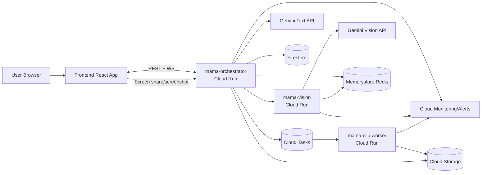

# Architecture Diagram

## Notes
- Unified realtime protocol is on `WS /ws/{sessionId}`.
- Legacy WS channels remain available for compatibility:
  - `/ws/sessions/{sessionId}`
  - `/ws/live/{sessionId}`
- Clip pipeline supports:
  - Async queue dispatch via Cloud Tasks
  - FFmpeg rendering
  - Upload to GCS with public clip URLs
